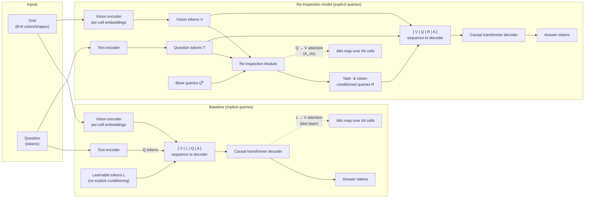

## Re-Inspection Module PoC

### Motivation

This PoC investigates whether **explicitly re-attending to a visual scene, conditioned on a natural language question**, improves both:

- **Task performance** (answer accuracy), and  
- **Attention quality** (does the model actually “look” at the right objects).

Instead of relying on a generic transformer to implicitly learn where to attend, the PoC introduces a **Re-Inspection Module** that structurally factors attention into two stages:

1. **Task conditioning on the question**  
2. **Visual re-inspection of the grid**

and compares this to a strong **baseline** that uses the same encoders and decoder, but without explicit re-inspection.

---

### Synthetic grid task

The task is a controlled, symbolic visual reasoning problem:

- Input: an \(8 \times 8\) grid with 2–5 objects.
  - Each cell can contain at most one object, defined by **color** (6 options) and **shape** (4 options).
- Two types of questions:

1. **Type A (relation)**  
   “is the **[color1] [shape1]** to the **[rel]** of the **[color2] [shape2]**?”  
   - Answer: `yes` or `no`.  
   - Ground-truth relevant cells: the two referenced objects.

2. **Type B (location)**  
   “where is the **[color] [shape]**?”  
   - Answer: row and column indices, e.g. `row 3 col 5`.  
   - Ground-truth relevant cells: the single referenced object.

Because the data is synthetic and symbolic:

- We know exactly **which cells are semantically relevant** for each question.
- We can quantitatively evaluate whether attention focuses on the correct locations.

---

### Architectures

Both models share the same core components:

- **Vision encoder**: symbolically encodes each grid cell via embeddings of:
  - color, shape, row, column → concatenated into a \(d\)-dim vector per cell.
- **Text encoder**: token embedding + positional embedding over a small fixed vocabulary.
- **Causal transformer decoder**: autoregressively decodes answer tokens from a sequence of embeddings.

The difference is entirely in **how they create query-like tokens that attend to the grid**.

#### Big picture at a glance

The diagram below summarizes the two models side by side.

Visually:

- The **baseline** learns where to look only via generic self-attention inside the decoder; its attention maps are extracted from **L→V attention in the last layer**.
- The **Re-Inspection model** first conditions global queries on the **question**, then re-attends these queries to the **vision tokens**, yielding **explicit, task-conditioned attention maps** that are used both for prediction and for interpretability.

#### Baseline model

Sequence layout:

$$[V(64) \mid L(N_q) \mid Q(L_q) \mid A(L_a)]$$

- `V`: vision tokens (one per cell).  
- `L`: **learnable query tokens** that do not explicitly condition on the question.  
- `Q`: question tokens.  
- `A`: answer-input tokens.

The whole sequence is fed into a stack of causal transformer blocks. To get an attention map over grid cells, the model:

- Extracts **L→V attention** from the last layer (learnable tokens attending to vision tokens).
- Averages over heads and over the `L` tokens to produce a single **64-dim attention map** per example.

This provides **implicit visual queries** that learn where to look, but they only get question information indirectly via generic self-attention on the sequence.

#### Re-Inspection model

Sequence layout:

\[
[V(64) \;|\; Q(L_q) \;|\; R(N_q) \;|\; A(L_a)]
\]

Here `R` comes from the **Re-Inspection Module**, which explicitly performs:

1. **Stage 1: Task conditioning on text**

   - Start from **global base queries** \(Q^0 \in \mathbb{R}^{N_q \times d}\) (same across the batch).
   - For each batch:
     \[
     Q^0 \rightarrow Q^{\text{task}} = \text{Transformer-style block with CrossAttn}(Q^0, T)
     \]
   - Cross-attention keys/values are the **question tokens** \(T\).

   Result: **task-conditioned queries** that know “what the question is asking”.

2. **Stage 2: Visual re-inspection**

   - Reuse \(Q^{\text{task}}\) as queries and cross-attend to **vision tokens** \(V\):
     \[
     Q^{\text{task}} \rightarrow R = \text{Transformer-style block with CrossAttn}(Q^{\text{task}}, V)
     \]
   - This yields:
     - Final tokens \(R \in \mathbb{R}^{B \times N_q \times d}\)  
     - Attention maps \(A_{\text{vis}} \in \mathbb{R}^{B \times N_q \times 64}\) (per-query distributions over cells)

These `R` tokens are then inserted into the decoder sequence. The **attention map over cells** is defined as:

- Average \(A_{\text{vis}}\) over queries and heads, then normalize over the 64 cells.

This gives a **direct, question-conditioned query→vision distribution** for each example.

---

### Metrics

Because we know the true relevant cells, we can define quantitative attention metrics:

- **Accuracy**  
  - Exact-match over non-PAD answer tokens.

- **Attention entropy**  
  - Shannon entropy of the 64-dim attention distribution:
    \[
    H(A) = -\sum_{c} p_c \log p_c
    \]
  - Lower entropy = more **concentrated** attention.

- **Attention IoU (Intersection-over-Union)**  
  - Take the **top-k** attended cells (k from config).  
  - Compute IoU between this predicted set and the ground-truth target cells:
    $$\text{IoU} = \frac{|S_{\text{pred}} \cap S_{\text{gt}}|}{|S_{\text{pred}} \cup S_{\text{gt}}|}$$
    
  - Higher IoU = attention overlaps more with the true objects.

- **Attention mass on target cells**  
  - Sum of attention probabilities over the target cells:
    \[
    \text{mass} = \sum_{c \in S_{\text{gt}}} p_c
    \]
  - Higher mass = more of the probability concentrated where it matters.

These metrics are computed per batch and aggregated:

- **Across epochs** (for validation)  
- **Across seeds** (for final test results)  
- **Separately for type A, type B, and all questions**

---

### What the PoC shows

The PoC generates several paper-style figures:

- **Figure 1 – Attention maps, baseline vs re-inspection**  
  - For a handful of test examples, plots:
    - The grid with objects (color/shape markers) and ground-truth target cells highlighted.
    - Heatmaps of:
      - Baseline attention over cells.
      - Re-Inspection attention over cells.
  - Qualitative goal: show that the re-inspection attention is **tighter and better aligned** with the true objects.

- **Figure 2 – Attention entropy over training**  
  - For each model, plots mean ± std attention entropy over epochs and seeds.
  - Intended to show that re-inspection leads to **lower entropy** (more confident, focused attention) while still learning well.

- **Figure 3 – Validation accuracy over training**  
  - Mean ± std accuracy curves for baseline vs re-inspection.
  - Intended to show that explicit re-inspection **does not hurt and may improve accuracy**, especially on the harder relational questions.

- **Figure 4 – Attention mass on target cells**  
  - Bar chart of average mass on ground-truth cells:
    - By question type (A, B, all) and model (baseline vs ours).
  - Intended to show higher mass on targets for the Re-Inspection model, i.e. **more of its attention goes where it should**.

- **Figure 5 – Per-query attention maps (optional)**  
  - For a few examples, shows one heatmap **per query token** \(Q_1, \dots, Q_{N_q}\).
  - This reveals that different queries often specialize to different spatial patterns or roles, giving a more fine-grained interpretability story.

---

### Takeaway

This PoC demonstrates that:

- You can **factor attention into task conditioning and visual re-inspection** with a small, clean architectural change (ReInspectionModule).
- On a synthetic but non-trivial grid reasoning task:
  - The re-inspection variant can achieve **competitive or better answer accuracy**, and
  - Produces **sharper, more semantically aligned attention** to the relevant objects, as quantified by entropy, IoU, and mass, and as illustrated visually in the figures.

In short, the PoC provides a compact, controlled environment to show that **explicit, structured re-inspection of a scene, conditioned on the question, improves both performance and interpretability** compared to a monolithic transformer baseline.

