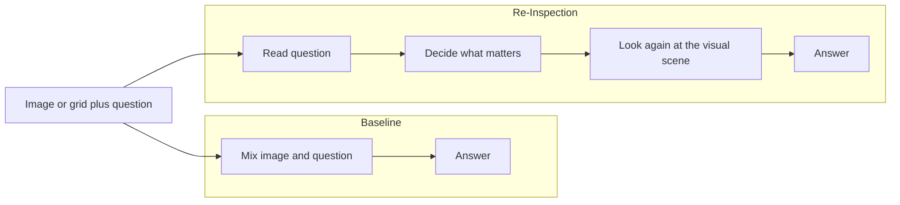
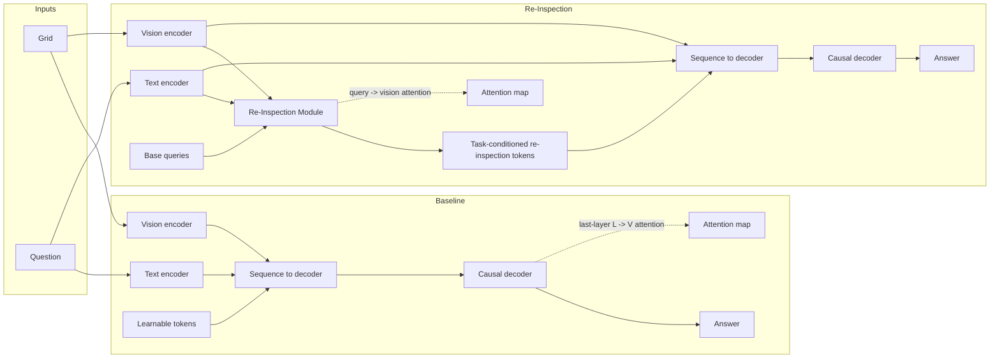

# Re-Inspection: Concept, PoC, and InternVL3 Implementation Plan

## 1. Purpose

This document consolidates the project motivation, the synthetic proof-of-concept
(PoC), and the detailed implementation plan for bringing the Re-Inspection
Module to a real vision-language model.

The central idea is simple:

> A model should not only read the question and process the image jointly. It
> should first understand what the question is asking, then deliberately look
> back at the scene with that task in mind, and only then answer.

The project is built around that claim.

At a high level, the work has two phases:

1. **Synthetic PoC**
   Show in a controlled environment that explicit question-conditioned
   re-inspection improves where the model looks and can improve how it answers.
2. **Real VLM implementation**
   Insert the same mechanism into InternVL3-8B, warm it up on grounding, then
   fine-tune it for spatial reasoning.

This document is meant to be both:

- a conceptual explanation of what Re-Inspection is and why it matters
- a technical reference for how it is intended to be implemented and evaluated

---

## 2. Intuition in plain language

The Re-Inspection idea is easiest to understand in everyday terms.

Imagine showing someone an image and asking a spatial question.

- Baseline behavior:
  they look at the image and the question together and try to answer in one
  blended pass.
- Re-Inspection behavior:
  they read the question first, decide what matters, and then look back at the
  image with a purpose.

That second behavior is what this project tries to add to the model.

The point is **not** to make the model arbitrarily larger or deeper.
The point is to impose a cleaner reasoning structure:

1. read the question
2. form task-aware queries
3. re-attend to the visual scene
4. answer from that focused inspection

The simplest picture is:



This is the entire thesis in one diagram.

---

## 3. What the synthetic PoC is trying to prove

The synthetic PoC exists to answer a narrow but important question:

> If we add an explicit question-conditioned re-inspection step, do we improve
> both answer quality and attention quality?

The PoC does **not** try to solve all of visual reasoning.
It creates a controlled setting where the model can only succeed if it learns to
focus on the right cells, and where the ground-truth relevant cells are known.

That control matters because it lets us measure not just whether the answer is
correct, but whether the model is attending to the correct parts of the scene
while producing the answer.

The PoC is designed to test two things:

- **Task performance**
  Does the model answer correctly?
- **Attention quality**
  Does the model actually place attention on the cells that matter?

---

## 4. Synthetic grid task

The synthetic task uses a symbolic `8 x 8` grid world.

### 4.1 Scene structure

Each example is an `8 x 8` grid containing `2` to `5` objects.

Each grid cell can contain at most one object.
An object is defined by:

- **color**: 6 options
- **shape**: 4 options

Each occupied cell is therefore a symbolic entity such as:

- red circle
- blue square
- green triangle

Because the environment is synthetic and symbolic:

- the full scene is perfectly observable
- the relevant target cells are known exactly
- no ambiguity comes from natural image clutter

### 4.2 Question types

The PoC uses two families of questions.

#### Type A: relation questions

Example:

> "Is the red circle to the left of the blue square?"

These are binary questions with answer:

- `yes`
- `no`

Ground-truth relevant cells:

- the cell containing object 1
- the cell containing object 2

#### Type B: localization questions

Example:

> "Where is the red circle?"

These are coordinate questions with answers such as:

- `row 3 col 5`

Ground-truth relevant cells:

- the single cell containing the queried object

### 4.3 Why this setup is useful

The synthetic task gives clean supervision for attention analysis:

- for relation questions, the correct attended region should include both
  referenced objects
- for localization questions, the correct attended region should include the
  target object only

So unlike natural-image benchmarks, we can directly ask:

> Did the attention land on the semantically relevant cells?

---

## 5. Shared model ingredients in the PoC

Both the baseline and the Re-Inspection model use the same overall ingredients.

### 5.1 Vision representation

Each grid cell is encoded symbolically using embeddings for:

- color
- shape
- row
- column

Those embeddings are concatenated into a vector of dimension `d`.
This produces one vision token per cell.

Since the grid has 64 cells, the visual stream has 64 tokens.

### 5.2 Text representation

The question is encoded through:

- token embeddings
- positional embeddings

The vocabulary is small and fixed because the task is synthetic.

### 5.3 Decoder

Both models use a causal transformer decoder that autoregressively emits answer
tokens.

The difference between the two models is **not** in the decoder itself.
The difference is in how they create the query-like tokens that attend to the
visual scene.

---

## 6. PoC architectures

The key comparison is:

- **Baseline**: implicit visual querying
- **Re-Inspection**: explicit task-conditioned visual querying

### 6.1 Big picture comparison



### 6.2 Baseline model

The baseline sequence layout is:

```text
[V(64) | L(N_q) | Q(L_q) | A(L_a)]
```

Where:

- `V`: vision tokens, one per cell
- `L`: learnable query tokens
- `Q`: question tokens
- `A`: answer-input tokens

The entire sequence is processed by the causal decoder.

The baseline gets an attention map by extracting:

- last-layer attention from `L` tokens to `V` tokens
- averaging over heads
- averaging over the learnable query-token positions

This yields a single 64-dimensional attention map over the grid.

#### Limitation of the baseline

The baseline query tokens are not explicitly conditioned on the question before
they attend to the scene.
They only gain task information indirectly via generic sequence processing.

So the baseline is asking the decoder to solve two problems at once:

1. understand the question
2. discover where to look

without a dedicated mechanism that cleanly separates those steps.

### 6.3 Re-Inspection model

The Re-Inspection sequence layout is:

```text
[V(64) | Q(L_q) | R(N_q) | A(L_a)]
```

The `R` tokens are produced by the Re-Inspection Module, which explicitly
performs two stages.

#### Stage 1: task conditioning on text

Start from learnable base queries:

```text
Q0 in R^(N_q x d)
```

These are the same across the batch before conditioning.

Then use cross-attention from `Q0` into the question token sequence `T`:

```text
Q0 -> CrossAttn(Q0, T) -> Q_task
```

Now the queries are aware of what the question is asking.

#### Stage 2: visual re-inspection

Reuse the task-conditioned queries as queries into the visual stream `V`:

```text
Q_task -> CrossAttn(Q_task, V) -> R
```

This produces:

- final re-inspection tokens `R`
- per-query attention maps over visual cells

The attention map used for analysis is derived from the explicit query-to-vision
distribution produced in this stage.

#### Why this is cleaner

This architecture imposes a reasoning order:

1. condition on the question
2. inspect the scene
3. answer

The model no longer has to discover that structure implicitly.
It is built into the computation.

---

## 7. What the attention maps mean

The attention maps are important because they are not just decorative
visualizations. They are one of the core outputs of the PoC.

### 7.1 Baseline attention map

For the baseline, the map is extracted from a later internal attention pattern:

- learnable tokens attending to vision tokens in the last decoder layer

This is an **indirect** attention signal.

### 7.2 Re-Inspection attention map

For the Re-Inspection model, the map comes directly from the explicit
question-conditioned visual lookup:

- task-conditioned queries attending to vision tokens

This is a **direct** attention signal.

That difference matters because the Re-Inspection attention is much easier to
interpret. It answers a cleaner question:

> Given this question, where did the model choose to inspect the scene?

---

## 8. Metrics used in the PoC

The PoC measures both answer quality and attention quality.

### 8.1 Accuracy

Accuracy is computed as exact match over non-padding answer tokens.

This answers:

> Did the model produce the correct answer?

### 8.2 Attention entropy

Entropy measures how concentrated the attention distribution is.

Formula:

```text
H(A) = - sum_c p_c log p_c
```

Interpretation:

- lower entropy means more focused attention
- higher entropy means more diffuse attention

This does **not** by itself mean the attention is correct.
It only tells us how concentrated it is.

### 8.3 Attention IoU

Take the top-`k` attended cells and compare them to the ground-truth relevant
cells.

Formula:

```text
IoU = |S_pred intersect S_gt| / |S_pred union S_gt|
```

Interpretation:

- higher IoU means the attended set overlaps better with the true target cells

### 8.4 Attention mass on target cells

Sum the attention probabilities over the ground-truth relevant cells:

```text
mass = sum_{c in S_gt} p_c
```

Interpretation:

- higher mass means more of the model's attention is concentrated on the cells
  that actually matter for the question

### 8.5 Why these metrics work together

Each metric captures something different:

- accuracy tells us whether the answer is right
- entropy tells us whether the attention is sharp or diffuse
- IoU tells us whether the attended cells overlap with the correct cells
- attention mass tells us how much probability lands on relevant cells

Together they make it possible to say not only that a model answered correctly,
but whether it seems to have answered for the right reason.

---

## 9. What the PoC is intended to show

The PoC is built to generate paper-style evidence.

### 9.1 Figure categories

The expected figures include:

1. **Attention maps**
   Baseline vs Re-Inspection heatmaps over the grid for selected examples.
2. **Attention entropy over training**
   Show whether Re-Inspection learns sharper attention.
3. **Validation accuracy over training**
   Show whether the explicit mechanism helps, or at least does not hurt,
   end-task performance.
4. **Attention mass on target cells**
   Show whether more attention probability lands on the correct cells.
5. **Optional per-query heatmaps**
   Show whether different queries specialize to different spatial roles.

### 9.2 Intended conclusion

The synthetic PoC is designed to support the claim that:

- explicit task-conditioned re-inspection can improve localization quality
- the mechanism can preserve or improve answer performance
- the learned attention is more interpretable because it is tied to an explicit
  query-to-vision operation

### 9.3 Documented PoC findings

The planning notes treat the synthetic PoC as already having validated the core
mechanism:

- dramatically better localization
- much higher attention mass on targets
- substantially lower attention entropy
- relation reasoning still limited by the toy decoder

The implication is that the mechanism itself looks promising, and the next step
is to combine it with a stronger language model that already understands
relations, syntax, and answer generation well.

---

## 10. Why move to InternVL3-8B

The second half of the project is about moving from the toy synthetic setup to
a real vision-language model.

The chosen backbone is **InternVL3-8B**.

### 10.1 Why this model was selected

The planning notes motivate InternVL3-8B for three reasons:

1. **Clean vision-to-LLM interface**
   The visual pipeline terminates in a simple projector output that is inserted
   into the language model input stream.
2. **No complicated multi-scale injection stack**
   This reduces the risk that the re-inspection signal gets washed out or mixed
   with several architectural confounds.
3. **Strong LLM backbone**
   The Qwen2.5-7B language model is already much stronger than the toy PoC
   decoder, especially for spatial relations.

### 10.2 Why this matters conceptually

The synthetic PoC suggests the mechanism can improve grounding.
The real VLM step tests whether that same mechanism improves spatial reasoning
when attached to a capable language model.

The argument is:

- the toy model struggled on harder relation questions because the decoder was
  weak
- a real LLM should already understand relational language much better
- if grounding is the bottleneck, improving grounding should help the stronger
  model more than it helped the toy setup

---

## 11. InternVL3-8B reference architecture

The documented InternVL3-8B path is:

```text
Image
  -> dynamic tiling (1 to 12 tiles + thumbnail at 448 x 448)
  -> InternViT-300M
  -> 1024 tokens per tile
  -> pixel_shuffle compression
  -> 256 tokens per tile
  -> MLP projector
  -> tokens in LLM hidden size
  -> replace <IMG_CONTEXT> placeholders
  -> Qwen2.5-7B language model
  -> logits
```

### 11.1 Key dimensions

- ViT hidden size: `1024`
- after pixel shuffle: `4096`
- projector output / LLM hidden size: `3584`
- LLM layers: `28`
- LLM attention heads: `28`
- KV heads: `4`

### 11.2 Important architectural observation

The visual tokens are already projected into the LLM hidden space before they
are inserted into the language model sequence.

That makes InternVL3 a good fit for Re-Inspection because the project can:

- extract the visual token embeddings `V`
- extract the text token embeddings `T`
- build a small module on top of them
- reinsert the resulting tokens back into the same sequence space

without redesigning the whole model.

---

## 12. Planned Re-Inspection architecture for InternVL3

The real-model version uses a bottlenecked Re-Inspection Module.

### 12.1 High-level computation

Let:

- `V` be the projected visual tokens in model dimension `3584`
- `T` be the text token embeddings in model dimension `3584`

The module first projects both streams into a bottleneck dimension `d_r`,
for example `256`.

```text
V_r = V * W_down_v
T_r = T * W_down_t
```

Then use learnable base queries `Q0`.

#### Stage 1: question conditioning

```text
Q0 -> CrossAttn(Q0, T_r) -> Q1
```

#### Stage 2: visual re-inspection

```text
Q1 -> CrossAttn(Q1, V_r) -> R_r
```

Then project the result back up to model width:

```text
R = R_r * W_up
```

The resulting tokens `R` are then inserted into the LLM input sequence.

### 12.2 Why use a bottleneck

Using the full model dimension for the whole module would be unnecessarily
expensive.

The bottleneck keeps the module:

- small
- cheap to train
- easy to optimize
- compatible with frozen large backbones

The planning notes estimate the Re-Inspection Module at roughly **1.8M**
parameters in this bottleneck form.

### 12.3 Intended role of the module output

The `R` tokens serve two purposes:

1. they provide a task-conditioned visual summary to the language model
2. they produce explicit attention maps `A_vis` that can be analyzed and, in
   Stage 1, supervised

---

## 13. Sequence layout and injection strategy

The key implementation question is where the `R` tokens should be inserted.

The intended sequence is:

```text
[system tokens] ... [ V </img>] [question tokens] [R1 ... RNq] [<assistant>] ...
```

So the re-inspection tokens are inserted:

- after the user question
- before the assistant answer begins

### 13.1 Why this insertion point is chosen

This placement means:

- the module sees the question before producing `R`
- the decoder sees `R` as part of the conditioning context for answer generation
- the `R` tokens function as task-conditioned intermediate evidence

### 13.2 Injection point in the forward pass

The documented insertion point is inside `InternVLChatModel.forward()`,
after image placeholders have already been replaced with vision embeddings and
before the language model is called.

The intended steps are:

1. extract vision embeddings `V`
2. extract question/text embeddings `T`
3. run the Re-Inspection Module
4. find the assistant-start token position
5. splice the `R` tokens into `inputs_embeds`
6. extend `attention_mask`
7. extend `position_ids`
8. extend `labels` with ignore positions at the inserted `R` slots
9. call the language model

### 13.3 Variable-length complications

This is not a trivial tensor insertion because each sample can differ in:

- number of visual tokens
- number of text tokens
- exact assistant-start position

So a correct batched implementation needs to handle:

- per-sample image token masks
- per-sample text extraction
- per-sample insertion offsets
- repadding after insertion

---

## 14. V2PE compatibility

The planning notes explicitly call out compatibility with InternVL's variable
visual position encoding scheme (V2PE).

The important observation is:

- visual tokens use special positional handling
- re-inspection tokens are **not** visual tokens

Therefore the planned behavior is:

- keep visual tokens under the existing visual-positioning scheme
- assign the `R` tokens standard text-like position ids

This keeps the re-inspection tokens aligned with the language-model side of the
sequence rather than pretending they are native image patches.

---

## 15. Project structure proposed in the planning notes

The standalone implementation plan proposes a package with:

```text
reinspection_internvl3/
  config.py
  reinspection_module.py
  modeling.py
  data/
    refcoco.py
    spatial_vqa.py
    chat_template.py
  train_stage1.py
  train_stage2.py
  evaluate.py
  visualize.py
  configs/
    stage1.yaml
    stage2.yaml
    deepspeed_z2.json
  scripts/
    run_stage1.sh
    run_stage2.sh
    run_eval.sh
  requirements.txt
```

This is useful because it clarifies the ownership boundaries:

- the module itself
- the model wrapper
- Stage-1 data
- Stage-2 data
- training entrypoints
- evaluation
- visualization

---

## 16. Re-Inspection Module specification

The planned module contains:

- down-projections for vision and text
- learnable base queries
- Stage-1 text cross-attention block
- Stage-2 vision cross-attention block
- FFN and normalization around both stages
- up-projection back to model width

The sketch given in the notes is:

```python
class ReInspectionModule(nn.Module):
    def __init__(self, d_model=3584, d_bottleneck=256, n_queries=32, n_heads=4, d_ff=1024):
        self.w_down_v = nn.Linear(d_model, d_bottleneck)
        self.w_down_t = nn.Linear(d_model, d_bottleneck)
        self.base_queries = nn.Parameter(torch.randn(n_queries, d_bottleneck) * 0.02)

        self.cross_attn_task = MultiHeadCrossAttention(d_bottleneck, n_heads)
        self.ln1 = nn.LayerNorm(d_bottleneck)
        self.ffn1 = FFN(d_bottleneck, d_ff)
        self.ln2 = nn.LayerNorm(d_bottleneck)

        self.cross_attn_vis = MultiHeadCrossAttention(d_bottleneck, n_heads)
        self.ln3 = nn.LayerNorm(d_bottleneck)
        self.ffn2 = FFN(d_bottleneck, d_ff)
        self.ln4 = nn.LayerNorm(d_bottleneck)

        self.w_up = nn.Linear(d_bottleneck, d_model)

    def forward(self, V, T):
        V_r = self.w_down_v(V)
        T_r = self.w_down_t(T)
        Q0 = self.base_queries.unsqueeze(0).expand(B, -1, -1)

        out, A_task = self.cross_attn_task(Q0, T_r)
        Q1 = ...

        out, A_vis = self.cross_attn_vis(Q1, V_r)
        R_r = ...

        R = self.w_up(R_r)
        return R, A_task, A_vis
```

This code sketch is conceptual rather than final, but it captures the intended
module behavior clearly.

---

## 17. Model-wrapper responsibilities

The planned `InternVL3WithReInspection` wrapper is expected to do four main
jobs.

### 17.1 Initialization

- load the parent InternVL model
- create the Re-Inspection Module
- register any extra special token ids if needed

### 17.2 Forward pass

The wrapper should:

1. compute or fetch the vision embeddings
2. obtain token embeddings for the textual sequence
3. replace image placeholders with projected image embeddings
4. extract `V` and `T`
5. run the Re-Inspection Module
6. insert `R` into the sequence
7. update masks and labels
8. call the language model
9. return loss and attention maps

### 17.3 Generation path

The same insertion logic is needed at inference time:

- compute `R`
- insert `R`
- delegate to the underlying generation method

### 17.4 Attention access

The wrapper should make the latest `A_vis` maps available for visualization and
analysis.

---

## 18. Stage 1 data plan: grounding warm-up

Stage 1 is intended to teach the module how to ground language in image regions.

### 18.1 Dataset family

The plan calls for RefCOCO-style referring-expression grounding data:

- RefCOCO
- RefCOCO+
- RefCOCOg

Each sample includes:

- image
- referring expression
- target bounding box

### 18.2 Stage-1 supervision format

The prompt is formatted as an instruction to locate an object.

Example pattern:

```text
User: <image>
Describe the location of: {expression}
Assistant: {answer}
```

The answer is a textual box/location description.

### 18.3 Attention-target construction

The plan also adds auxiliary supervision by mapping the target box to the patch
grid.

That means:

1. project the bounding box onto the effective image-token layout
2. mark visual patches that overlap the box
3. flatten into an `(N_v,)` patch mask
4. normalize that mask into a distribution

This patch distribution is then used as the target for the Stage-1 attention
loss.

### 18.4 Why Stage 1 exists

Stage 1 is a grounding warm-up.

Its purpose is not yet broad reasoning.
Its purpose is to make the re-inspection attention maps spatially meaningful
before trying to solve higher-level spatial reasoning tasks.

---

## 19. Stage 2 data plan: spatial reasoning fine-tuning

Stage 2 moves from grounding to broader spatial reasoning.

The planned Stage-2 data mix includes:

- **VSR**
  binary spatial relations
- **What'sUp**
  orientation understanding
- **GQA spatial subset**
  spatial VQA
- **SpatialBench**
  depth, proximity, contact, counting, and size style questions

All of these are reformatted into the InternVL chat template so that the model
is trained as a multimodal instruction-following system.

The intended user/assistant formatting is:

```text
<|im_start|>system
You are a helpful assistant.
<|im_end|>
<|im_start|>user
<image>
{question}
<|im_end|>
<|im_start|>assistant
{answer}
<|im_end|>
```

Stage 2 is where the project tests whether better grounding helps real spatial
reasoning benchmarks.

---

## 20. Training plan

The project uses a two-stage training strategy.

### 20.1 Stage 1: spatial grounding warm-up

Documented settings:

| Setting | Planned value |
|---|---|
| Trainable | Re-Inspection Module, optionally MLP projector |
| Frozen | ViT and LLM |
| Loss | `L_CE + lambda * L_attn` |
| Data | combined RefCOCO family |
| LR (module) | `1e-4` |
| LR (projector) | `1e-5` |
| Scheduler | cosine, 3% warmup |
| Effective batch | 128 via accumulation |
| Epochs | 3 to 5 |
| `lambda` | 0.5, tuned on validation |
| Precision | bf16 |

Purpose:

- bootstrap spatially meaningful visual attention
- directly supervise the re-inspection mechanism before reasoning fine-tuning

### 20.2 Stage 2: spatial reasoning fine-tuning

Documented settings:

| Setting | Planned value |
|---|---|
| Trainable | Re-Inspection Module plus LoRA on LLM |
| Frozen | ViT and MLP projector |
| Loss | `L_CE` only |
| Data | VSR + What'sUp + GQA spatial + SpatialBench |
| LR (module) | `5e-5` |
| LR (LoRA) | `2e-5` |
| LoRA rank | 16, alpha 32 |
| Scheduler | cosine, 3% warmup |
| Effective batch | 64 via accumulation |
| Epochs | 5 to 10 |
| Precision | bf16 |
| DeepSpeed | ZeRO-2 |

Purpose:

- teach the language model to use the re-inspection tokens for actual spatial
  reasoning tasks

### 20.3 Why the losses differ by stage

The training plan deliberately changes the loss between the two stages.

- **Stage 1**
  use explicit grounding supervision to shape the module's attention
- **Stage 2**
  drop the explicit attention loss and let answer supervision drive behavior

The logic is:

- first teach the module to look in the right place
- then teach the larger system to use that signal for reasoning

---

## 21. Evaluation plan

The evaluation plan compares three systems:

1. **InternVL3-8B frozen**
   zero-shot baseline
2. **InternVL3-8B + LoRA only**
   tests whether gains come merely from fine-tuning the LLM
3. **InternVL3-8B + Re-Inspection + LoRA**
   the full proposed method

### 21.1 Planned benchmarks

| Benchmark | Metric | What it tests |
|---|---|---|
| VSR | Accuracy | binary spatial relations |
| What'sUp A | Accuracy | orientation understanding |
| What'sUp B | Accuracy | harder orientation understanding |
| GQA spatial | Accuracy | general spatial VQA |
| SpatialBench | per-category accuracy | depth, proximity, size, counting, contact |

### 21.2 Planned attention-side metrics

Where annotation permits, the evaluation should also compute:

- attention entropy
- attention mass on target patches

This preserves the central project theme:

the model should not only answer better, but should also look better.

---

## 22. Visualization plan

Visualization is a first-class output of the project.

The documented approach is:

1. extract `A_vis` during inference
2. map the visual-token axis back to image coordinates
3. average across queries when a single heatmap is desired
4. overlay the result on the original image
5. compare baseline attention with Re-Inspection attention

This is important because the module is intended to improve interpretability,
not just raw benchmark scores.

The optional per-query maps are especially valuable because they can reveal
query specialization:

- one query may lock onto the reference object
- another may look at the comparison object
- another may focus on spatial context

That kind of structure is hard to see when attention is only extracted from a
generic decoder layer.

---

## 23. Parameter budget

The planning notes estimate the following:

| Component | Parameters | Trainable? |
|---|---|---|
| InternViT-300M | 300M | Frozen |
| MLP projector | about 29M | Stage 1 only, optionally |
| Re-Inspection Module | about 1.8M | Yes |
| LoRA on q_proj and v_proj | about 6.3M | Stage 2 only |
| Qwen2.5-7B LLM | about 7.6B | Frozen except LoRA |
| Total trainable | about 8.1M | about 0.1% of full model |

This budget matters because it shows the project is not trying to retrain the
whole foundation model.
It is a parameter-efficient architectural intervention.

---

## 24. Memory estimate

The documented rough bf16 estimate for InternVL3-8B is:

| Component | Memory |
|---|---|
| Model weights | about 16 GB |
| Re-Inspection Module | about 4 MB |
| LoRA adapters | about 13 MB |
| Optimizer states on trainable params | about 50 MB |
| Activations at batch 4, seq 2048 | about 8 GB |
| Total | about 25 GB |

This suggests:

- a single A100-40GB should be enough
- gradient accumulation can be used to reach larger effective batch sizes
- multi-GPU training with DeepSpeed ZeRO-2 becomes relevant for larger batches

---

## 25. Verification checklist

The planning notes include a concrete verification checklist.

### 25.1 Smoke test

Load InternVL3-8B with the Re-Inspection Module and run a single forward pass.

Verify:

- output shapes are correct
- no NaNs
- `R` tokens are inserted where expected
- loss computes

### 25.2 Sequence check

Print or inspect a sample token sequence to verify the insertion position:

- after user content
- before assistant start

### 25.3 Gradient check

Verify gradient flow:

- gradients should reach Re-Inspection parameters
- gradients should reach LoRA parameters in Stage 2
- gradients should **not** reach the frozen ViT or frozen base LLM weights

### 25.4 Stage-1 convergence check

After early Stage-1 training:

- the attention loss should decrease
- `A_vis` should visibly begin to concentrate on referred objects

### 25.5 Stage-2 benchmark check

After fine-tuning:

- VSR accuracy should exceed both the frozen baseline and the LoRA-only control

### 25.6 Figure generation check

Generate several side-by-side qualitative examples showing:

- baseline attention
- re-inspection attention
- image/task relevance

This is necessary to support the interpretability claim visually.

---

## 26. Critical reference files mentioned in the planning notes

The planning notes identify several key resources:

| File | Purpose |
|---|---|
| `reinspection_module_formulation.md` | mathematical specification of the module and training |
| InternVL3 `modeling_internvl_chat.py` | source for subclassing and insertion logic |
| InternVL3 `configuration_internvl_chat.py` | model config structure |
| `Concepts/Differentiable Visual Reinspection.md` | broader conceptual context |

These references matter because the project sits at the intersection of:

- a mathematical idea
- a real code integration point
- a training recipe
- an interpretability story

---

## 27. Core thesis of the whole project

All three source notes point to the same underlying claim:

1. Standard decoder-only or monolithic transformer processing does not force the
   model to perform an explicit, question-guided second look.
2. A lightweight module can create that second look by structurally separating:
   - task understanding
   - visual inspection
3. This separation should improve:
   - grounding quality
   - interpretability
   - downstream spatial reasoning

The synthetic PoC exists to validate the mechanism cleanly.
The InternVL3 plan exists to test whether that mechanism continues to help in a
real multimodal language model.

---

## 28. Concise takeaway

The project can be summarized in one sentence:

> Re-Inspection adds an explicit question-conditioned visual lookup step between
> reading the prompt and producing the answer.

Everything else in this document is there to operationalize that idea:

- the PoC makes it measurable
- the metrics make it testable
- the InternVL3 design makes it practical
- the training plan makes it learnable
- the evaluation and visualization plan make it defensible

If the idea works, the resulting model should not only answer spatial questions
better. It should also make it clearer **why** it answered the way it did,
because its attention is tied to a deliberate second inspection of the scene.
