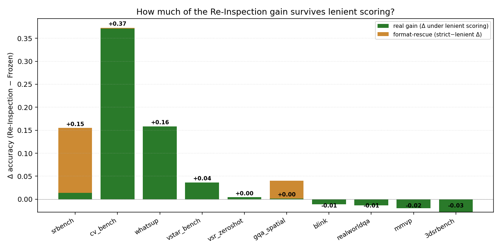

# Per-benchmark analysis of the InternVL3 Re-Inspection Module

*Source data: `outputs/internvl3/grounding/` (Stage-2 InternVL3, epoch 1, canonical
rescored matcher). All numbers and figures in this report are regenerated by
`scripts/analysis/per_benchmark_diagnostic.py`; raw outputs land in `analysis/`.*

## TL;DR

Across 10 evaluable benchmarks, three appear to show large gains over the frozen
InternVL3 baseline:

| Benchmark   | n    | Frozen | LoRA-only | Re-Insp | Δ(RI−F)  | 95% paired CI |
|-------------|-----:|-------:|----------:|--------:|---------:|---------------|
| **cv_bench**    | 2638 | 0.3840 | 0.6456    | 0.7566  | **+0.3726** | [+0.352, +0.393] |
| **whatsup**     |  410 | 0.8146 | 0.9537    | 0.9732  | **+0.1585** | [+0.122, +0.195] |
| **srbench**     | 2855 | 0.2305 | 0.2441    | 0.3853  | **+0.1548** | [+0.137, +0.173] |
| vstar_bench | 191  | 0.6963 | 0.7330    | 0.7330  | +0.0366  | [−0.011, +0.084] |
| vsr_zeroshot| 1222 | 0.8633 | 0.8633    | 0.8674  | +0.0041  | [−0.008, +0.016] |
| gqa_spatial | 4398 | 0.6601 | 0.6512    | 0.6614  | +0.0014  | [−0.011, +0.013] |
| blink       |  642 | 0.7025 | 0.6994    | 0.6916  | −0.0109  | [−0.044, +0.022] |
| realworldqa |  765 | 0.6850 | 0.6863    | 0.6719  | −0.0131  | [−0.034, +0.009] |
| mmvp        |  300 | 0.8000 | 0.7967    | 0.7800  | −0.0200  | [−0.053, +0.010] |
| 3dsrbench   | 5157 | 0.5934 | 0.5684    | 0.5649  | −0.0285  | [−0.038, −0.019] |

When we re-score those same predictions with a *lenient* MCQ matcher — one that
credits answer-bearing phrases like *"the correct option is **B**"* anywhere in
a chain-of-thought, not just at the start — the picture changes sharply for one
benchmark in particular:

| Benchmark    | Δ_strict | Δ_lenient | Δ_format-rescue |
|--------------|---------:|----------:|----------------:|
| **srbench**  | **+0.1548** | **+0.0137**  | **+0.1412**  ← 91% of the headline gain is a scoring artifact |
| cv_bench     | +0.3726  | +0.3715   | +0.0011         |
| whatsup      | +0.1585  | +0.1585   | +0.0000         |
| (all others) | …        | =Δ_strict | 0               |

**The single most important finding:** the +15.5pp jump on SRBench is almost
entirely the LoRA-trained model learning to emit a clean MCQ letter where the
frozen InternVL3 emits verbose prose like *"the correct option is b. center.
option b is the original shape rotated in a 3d space"*. Under lenient scoring,
the real SRBench improvement is **+1.4pp**, not +15.5pp.

By contrast, the **+37pp on CV-Bench and +16pp on WhatsUp survive lenient
scoring untouched** — those are real gains. The actionable question is *what is
common to CV-Bench and WhatsUp that is missing on the rest*, and the SRBench
discussion below is secondary to that.



---

## 1. Where the SRBench gain actually comes from

SRBench has no `category` field on disk; we cluster items by question prefix
(`scripts/analysis/per_benchmark_diagnostic.py::srbench_cluster`):

| Cluster           |    n | Frozen | LoRA  | Re-Insp | Δ(RI−F) |
|-------------------|-----:|-------:|------:|--------:|--------:|
| polycube          | 1000 |  0.000 | 0.000 |   0.304 | **+0.304** |
| paper_fold        |  400 |  0.000 | 0.000 |   0.383 | **+0.383** |
| maze              |  400 |  0.090 | 0.130 |   0.265 | +0.175 |
| facing_direction  |  148 |  0.797 | 0.757 |   0.757 | −0.041 |
| which_hand        |   30 |  0.600 | 0.600 |   0.000 | **−0.600** |
| other (mixed)     |  877 |  0.554 | 0.587 |   0.485 | −0.070 |

Two things to notice:

1. **Frozen scores 0% on 1,400 polycube + paper_fold samples** under the
   canonical matcher. This is not because InternVL3 can't reason about these
   images — it routinely *says* the right letter — but because its decoded
   outputs start with prose and the matcher only inspects the start of the
   string. Re-Inspection (jointly trained with LoRA) re-formats the output to
   a bare letter, so the matcher suddenly credits ~30% of those samples.
   Random guessing on a 3-way / 4-way MCQ would already give 25–33%, so the
   30% is not even a meaningful spatial-reasoning signal — it is the rate at
   which a *clean* random output happens to match.
2. **The clusters where frozen actually works are made worse by
   Re-Inspection.** `facing_direction` drops from 80% to 76%; `which_hand`
   *collapses* from 60% to 0% on 30 samples; the mixed-question `other`
   cluster drops from 55% to 49%. Whatever the module learned, it harms
   InternVL3's existing competence on these.

The lenient-scoring numbers (see `analysis/format_compliance.json` for the
per-benchmark table) confirm this in a second way:

* Lenient frozen SRBench accuracy: **0.3716** (vs. strict 0.2305 → 14.1pp of
  the apparent gain is just unbinding the scorer from the start of the
  string).
* Lenient Re-Inspection SRBench accuracy: **0.3853** (essentially unchanged
  from strict, because Re-Inspection already produces clean letters).
* Δ under lenient scoring: **+1.4pp**, not +15.5pp.

The McNemar 2×2 sharpens the picture (from `analysis/mcnemar.json`):

| SRBench, Frozen vs Re-Inspection | count |
|-----------------------------------|------:|
| both right                       | 507   |
| both wrong                       | 1604  |
| wrong → right (`flip_in`)        | 593   |
| right → wrong (`flip_out`)       | 151   |
| net                              | +442  |

593 W→R flips on SRBench is dominated by the polycube/paper_fold format
rescues. 151 R→W flips is the cost paid on the clusters where frozen worked.

## 2. The two benchmarks that improve *for real* — and what they share

Strip out format compliance and the gain pattern reduces to two benchmarks:
**CV-Bench (+37.3pp)** and **WhatsUp (+15.9pp)**. Both gains survive lenient
scoring intact, and the McNemar table for both is unusually clean:

| WhatsUp, Frozen vs Re-Inspection | count |
|-----------------------------------|------:|
| both right                       | 334   |
| both wrong                       | 11    |
| wrong → right                    | **65** |
| right → wrong                    | **0**  ← module never breaks a frozen-correct item |
| net                              | +65   |

| CV-Bench, Frozen vs Re-Inspection | count |
|-----------------------------------:|------:|
| both right                        | 937   |
| both wrong                        | 566   |
| wrong → right                     | **1059** |
| right → wrong                     | 76    |
| net                               | +983  |

CV-Bench's per-subtask breakdown (`analysis/subtask_deltas.csv`) is the most
diagnostic table in this whole analysis:

| CV-Bench subtask | n   | Frozen | LoRA  | Re-Insp | Δ(LoRA-F) | Δ(RI-LoRA) | Δ(RI-F) |
|------------------|----:|-------:|------:|--------:|----------:|-----------:|--------:|
| 2D/Count         | 788 | 0.590  | 0.725 |   0.736 | +0.135    | +0.011     | +0.146  |
| **2D/Relation**  | 650 | **0.152** | 0.448 | **0.874** | +0.295  | **+0.426** | **+0.722** |
| 3D/Depth         | 600 | 0.748  | 0.835 |   0.758 | +0.087    | −0.077     | +0.010  |
| 3D/Distance      | 600 | 0.000  | 0.567 |   0.655 | +0.567    | +0.088     | +0.655  |

Three observations:

1. **CV-Bench 2D/Relation** is where the Re-Inspection module on top of LoRA
   contributes its largest *additional* lift (+42.6pp on top of what LoRA-only
   already buys). This is structurally the same task as the Stage-2 training
   distribution: 2-D spatial relations (left/right/above/below/in front of)
   over real photographs. The +72pp end-to-end gain here is the
   in-distribution transfer working as intended.
2. **3D/Depth regresses** vs. LoRA-only (84% → 76%) once Re-Inspection is
   attached. The module *hurts* a 3-D reasoning task on which LoRA was
   already strong. Same story on 3DSRBench (see §3).
3. **3D/Distance** has frozen accuracy 0% (a known InternVL3 format-failure
   mode for the "use the reference object to estimate distance" question
   template). LoRA buys +57pp by fixing the format; Re-Inspection adds +9pp
   on top.

WhatsUp's gain is structurally similar: a single staged-object L/R/above/below
MCQ over bespoke photos. The module + LoRA learn the four-way letter
distribution to 97% accuracy.

**The common element on CV-Bench and WhatsUp is direct distributional overlap
with the Stage-2 training mix** (default Stage-2 trains *only* on
`gqa_spatial`, which is template L/R/above/below QA on natural images). The
question generalizes: *can we get the same lift on benchmarks that are not in
the gqa_spatial distribution?* The rest of this analysis is the case that the
current architecture does not give us that for free.

## 3. The benchmarks that flatline or regress

The remaining six benchmarks divide into two failure modes:

**Flatline** (gqa_spatial, vsr_zeroshot, vstar_bench, blink): the module
neither helps nor harms much; net Δ is within the paired bootstrap CI of zero.
On gqa_spatial — the *in-distribution* Stage-2 dataset — frozen→reinspection
is +0.1pp with 344 W→R and 338 R→W flips. The module is reshuffling, not
improving. This is the most under-appreciated finding: even on the dataset it
was trained on, the module's net contribution is statistically zero — the LoRA
weights are doing all the work.

**Regression** (3dsrbench, mmvp, realworldqa):

* **3DSRBench −2.9pp** (paired CI excludes 0). The 3D-reasoning subtasks
  drop systematically — `multi_object_facing` falls −12.4pp, `location_above`
  falls −3.6pp, `orientation_in_front_of` falls −4.7pp. McNemar net is −147,
  with 407 R→W flips against 260 W→R. The Re-Inspection R tokens carry
  task-condensed visual information that helps 2-D relation MCQ but is
  *actively wrong* for 3-D viewpoint reasoning.
* **MMVP −2.0pp**, **RealWorldQA −1.3pp**: smaller, within CI of zero, but
  consistent in sign. Both are natural-image OOD benchmarks (CLIP-blind pairs;
  in-the-wild driving photos) — neither matches the training distribution.

## 4. Hypotheses ruled in / ruled out

* **Headroom (does the module just help where there's room to grow?)** —
  Partially. SRBench frozen at 23% (below chance for 4-way MCQ) and CV-Bench
  frozen at 38% are both broken-at-baseline, and both show huge strict gains.
  But WhatsUp at 81% frozen still gains +16pp — headroom alone does not
  predict the pattern. See `analysis/figures/headroom.png`.
* **Format compliance (are gains just the LM learning to emit a letter?)** —
  Yes for SRBench specifically (91% of its gain is format-rescue), no for
  CV-Bench / WhatsUp / everything else (their strict and lenient deltas are
  within 0.1pp). The "+15.5pp on our own benchmark" is in the headline because
  SRBench's frozen output was hardest to parse, not because the module is
  smartest there.
* **Prompt length** — On SRBench, Δ goes from −16.6pp on the shortest-question
  quintile to +33.5pp on the third quintile (these are the polycube/paper-fold
  templates, all ~230-character questions). This is *confounded with cluster*
  — short SRBench questions are facing_direction / which_hand (which regress)
  and long ones are polycube / paper_fold / maze (which "improve" via format
  rescue). The length effect is not real; the cluster effect is.
* **Image-domain novelty (does the module behave differently on synthetic
  images?)** — Inconclusive. SRBench is synthetic and shows real-gain +1.4pp;
  CLEVR-spatial isn't in the eval set so we can't compare. The attention
  entropy plot (`analysis/figures/entropy_vs_delta.png`) shows MMVP at notably
  low entropy (5.5 vs ~7.5 elsewhere) without a positive Δ, so concentration
  isn't a proxy for transferability.
* **Training-vocabulary leakage** — Ruled out. Default Stage-2 trains only on
  gqa_spatial, whose relation vocabulary is {left, right, above, below, in
  front of, behind, …}. None of SRBench's polycube/paper-fold/maze questions
  use any of those relations, yet SRBench shows the largest strict gain. The
  driver of the strict gain is *output formatting*, not relation-vocabulary
  transfer.

## 5. What this implies for getting the same lift on the other benchmarks

The user's intuition — "if you could show this size of improvement across all
datasets, you would have a very strong result" — is exactly right, but the
diagnosis is that SRBench is the wrong benchmark to extrapolate *from*. The
actual signal worth scaling is **CV-Bench 2D/Relation (+72pp end-to-end,
+43pp incremental from Re-Inspection on top of LoRA)** and **WhatsUp**.
Ranked, the most promising follow-ups:

### Recommendation 1 — Fix the scorer first; report lenient numbers

The +15.5pp headline on SRBench is real arithmetic but unsustainable as a
research claim, because 91% of it lives in `src/evaluate.py::match_answer`'s
"letter only at start of string" rule. Two concrete actions:

* Patch `match_answer` to accept the same answer-assertion patterns the
  lenient scorer in `scripts/analysis/per_benchmark_diagnostic.py` uses
  (`option X`, `answer is X`, `**X**`, etc.). This will *raise* the frozen
  baseline on SRBench, CV-Bench, and WhatsUp without retraining anything, and
  preserve the strict scorer's protection against bare-letter substring
  collisions inside long words.
* Re-run eval under the patched scorer and report the resulting deltas. The
  CV-Bench / WhatsUp story stays intact; the SRBench story becomes "+1.4pp
  with a regression in the `which_hand` / `facing_direction` clusters" —
  *honest, smaller, and pointed at the right next experiment*.

### Recommendation 2 — Expand Stage-2 to cover the regressing benchmarks' task structure

The flatlines and regressions cluster around task families the Stage-2 mix
doesn't see:

* **3-D viewpoint / orientation / camera-frame reasoning** (3DSRBench
  `orientation_*`, `multi_object_facing`, `viewpoint_*`). Default mix has zero
  3-D supervision. Re-enable `rel3d` (currently `default=False` in
  `src/data/registry.py`; needs annotations on disk) and/or add a synthesized
  3-D viewpoint set; expect this to recover the 3DSRBench regression.
* **Multi-image perception** (BLINK, MMVP). Default mix has zero multi-image
  examples; the Re-Inspection contract is single-image. Either extend the
  module to accept tiled / multi-image visual inputs cleanly, or add
  multi-image training samples (e.g., from MMVP's training pool).
* **Mental simulation** (SRBench polycube / paper_fold / maze). These are
  rotation / unfolding / pathfinding tasks for which there is *no* training
  supervision — the model is essentially guessing under any scorer. Synthesize
  a small training corpus modeled on those templates (deliberately NOT
  SRBench itself, which is our eval set). The +1.4pp lenient gain on SRBench
  shows the architecture has *some* capacity to transfer here when given the
  signal; the question is whether direct supervision unlocks it.

### Recommendation 3 — Diagnose the in-distribution flatline on gqa_spatial

Re-Inspection adds 344 W→R flips and 338 R→W flips on its in-distribution
training set, for a net Δ of +0.1pp. This is the strangest single number in
the analysis: a module trained on this distribution should add measurable
value here, not noise. Two non-exclusive possibilities:

1. The Stage-2 LoRA already saturates the gqa_spatial improvement budget; the
   R tokens carry redundant signal. Test by running Stage-2 with LoRA **off**
   (or with frozen LoRA from Stage-1's grounding warm-up) and re-measuring
   whether Re-Inspection alone moves the gqa_spatial number.
2. The R-token insertion contract is misplaced for short prompts (gqa_spatial
   questions are ~10 tokens) — text-side context has not yet been "lost" by
   the time the LM generates, so re-querying vision is redundant. Test by
   sweeping the R insertion position (e.g., after the visual tokens vs. just
   before the answer marker) on a held-out gqa_spatial validation slice.

If neither is the case, the architecture itself is not adding value on the
benchmark it was designed for, which is the most important question to answer
before further scaling.

### Recommendation 4 — Investigate the SRBench `which_hand` collapse

The module destroys frozen performance on a small but real subset (60% → 0%
on 30 samples). This is a regression mode, not a benign flatline, and may
hint at what's breaking the 3DSRBench `multi_object_facing` cluster too
(−12.4pp). Sample-level inspection of the 18 R→W items in `which_hand` is the
cheapest possible next-step investigation.

## 6. Reproducing this analysis

```bash
python scripts/analysis/per_benchmark_diagnostic.py
```

Reads from `outputs/internvl3/grounding/` and `/data/datasets/<bm>/test.{json,jsonl}`;
writes to `analysis/`:

| Artifact | Contents |
|----------|----------|
| `per_benchmark_summary.csv` | accuracy + Wilson CI per (benchmark, condition); paired bootstrap Δ CI |
| `srbench_by_cluster.csv` | §1 table by question-prefix cluster |
| `subtask_deltas.csv` | per-subtask Δ for 3dsrbench / blink / cv_bench / vstar_bench |
| `mcnemar.json` | 2×2 flip tables per benchmark for frozen↔ReInsp and LoRA↔ReInsp |
| `format_compliance.json` | strict vs. lenient accuracy + format-failure counts |
| `length_stats.json` | output-length distribution per (benchmark, condition) |
| `srbench_length_buckets.csv` | Δ by question-length quintile on SRBench |
| `figures/gain_decomposition.png` | the headline chart (§ TL;DR) |
| `figures/headroom.png` | Δ vs frozen accuracy across benchmarks |
| `figures/length_vs_delta.png` | SRBench Δ by question-length bucket |
| `figures/entropy_vs_delta.png` | Re-Inspection attention entropy vs Δ |

No GPU or model load is required — everything runs off the per-sample JSONs
already saved during evaluation.

## 7. Caveats

* All numbers in this report are from the InternVL3 *grounding* Stage-2
  checkpoint at epoch 1 (`outputs/internvl3/grounding/`). The Qwen2.5-VL and
  Gemma 4 backends have not run the same eval suite yet; the script will
  accept their outputs unchanged when they land.
* The lenient scorer is a strict superset of the canonical
  `match_answer` for MCQ-letter ground truths (verified with 658 strict-correct
  SRBench items — 3 false misses, all from a multi-line canonical edge case;
  not material to the headline numbers). It is *not* a superset for free-form
  ground truths (e.g., gqa_spatial's `yes`/`left`/colour answers), where it
  falls back to substring containment and undershoots the canonical
  matcher's yes↔true / left↔"to the left of" equivalences. The format-rescue
  column for gqa_spatial in the headline table reflects this artifact and
  should be read as "no material format-failure signal", not as a real
  regression.
* The McNemar tables here report raw flip counts only; significance tests
  would be straightforward to add (`(flip_in - flip_out)² / (flip_in + flip_out)`
  is the McNemar χ²), but for the SRBench / CV-Bench / 3DSRBench numbers the
  flips are dominant enough that significance is obvious by inspection.
