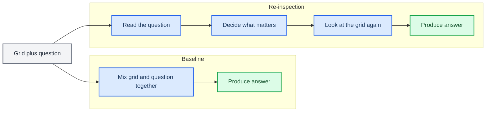

# Simple explanation of the Re-Inspection PoC

_Companion note to [doc.md](./doc.md), written in plain language_

---

## What this PoC is about

This PoC asks a very simple question:

If a model first understands the question, and then looks at the scene again with that question in mind, does it do a better job?

The scene here is a small grid with colored shapes. The model gets a question such as:

- "Where is the red circle?"
- "Is the blue square to the left of the green triangle?"

The model must answer correctly, but that is only part of the story. We also want to know whether it is looking at the right cells in the grid while answering.

---

## The core idea in everyday terms

Imagine showing someone a busy board with a few objects on it.

- The baseline way is: they look at the whole board and the question at roughly the same time, then try to answer.
- The re-inspection way is: they read the question first, decide what matters, and then look back at the board with a purpose.

That second behavior is what this PoC is trying to add to the model.

So the main idea is not "make the model bigger" or "make the model deeper".

The idea is:

1. Read the question.
2. Decide what kind of thing to look for.
3. Look at the grid again with that goal in mind.
4. Answer from that focused inspection.

---

## A simple picture of the idea

---

## How to read the full visualization in `doc.md`

The full diagram in [doc.md](./doc.md) shows the same idea, but with the real model parts.

- The left side is the baseline model.
- The right side is the re-inspection model.
- Both models start with the same two inputs:
  - the grid
  - the question
- Both models also end in the same place:
  - they produce answer tokens

The important difference is the middle of the pipeline.

### Baseline side

On the baseline side, the model gets vision tokens, question tokens, and some learnable helper tokens, then pushes all of that through the decoder.

In simple terms:

- the model has to figure out where to look inside its normal processing flow
- there is no explicit "now look again based on the question" step

### Re-inspection side

On the re-inspection side, there is a dedicated Re-Inspection Module in the middle.

That module does two things:

1. It reads the question and turns generic query tokens into task-aware query tokens.
2. It uses those question-aware queries to look back over the grid.

Only after that focused lookup does the model continue to the decoder and generate the answer.

So the right side of the diagram is showing a cleaner reasoning pattern:

- understand the question first
- inspect the scene second
- answer third

### What the dotted attention arrows mean

The dotted arrows in the full diagram show where the attention map comes from.

- In the baseline model, the attention map is extracted from a later internal attention pattern.
- In the re-inspection model, the attention map comes directly from the explicit question-to-vision lookup.

That matters because it makes the re-inspection model easier to interpret. Its attention map is closer to a direct answer to the question:

"Given this question, which cells did the model choose to inspect?"

---

## Why this matters

If the idea works, the re-inspection model should do two things better than the baseline:

- answer at least as well, and ideally better
- place more attention on the truly relevant cells

That is why the PoC measures both:

- answer accuracy
- attention quality

Attention quality is checked with metrics such as:

- how concentrated the attention is
- how much of it lands on the correct cells
- how much it overlaps with the true target cells

---

## The short version

This PoC is about teaching a model to "look twice on purpose".

Instead of hoping the model will automatically focus on the right objects, the re-inspection design gives it an explicit step to:

- understand the question
- revisit the visual scene
- focus on the relevant cells
- then answer

That is the whole point of the visualization: the baseline mixes everything together, while the re-inspection model adds a deliberate question-guided second look.

